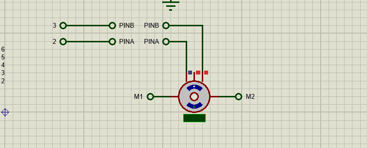

# What is this repo for?

- This repo contains arduino (Mega 2560) code to    control DC motor using sofware PID.
- This motor will be responsible for rotating the driving steer.
- The rotation angle will be received from external server.

## GIF

